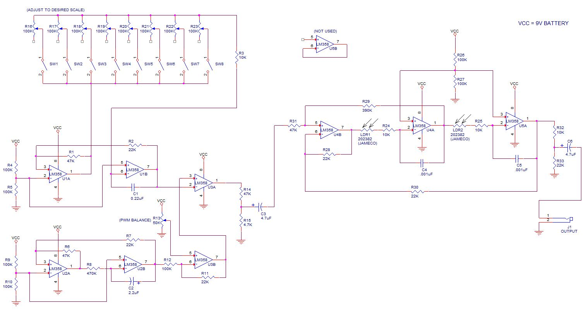

# LM358synth
Pete McBennet's "simplest DIY"  dual oscillator synth at [https://www.youtube.com/watch?v=yZSkNASlMjM]. See also [https://www.youtube.com/watch?v=wPeH6KfH8RY] for layout on a breadboard. And [https://www.youtube.com/watch?v=GxnAC2Ivmbs]

Schematic from [https://drive.google.com/file/d/0Bzxodk3UiKRgSXc0OVBWQnNfM00/view]

## BOM

'*' means that its done on the breadboard!

- 47k		1* ,6* ,14* ,31*
- 22k		*ordered* 2,7,11,28,30,33
- 10k		3* ,24* ,25* ,32*
- 100k		4* ,5* ,9* ,10* ,12* ,26* ,27*
- R8  		470k*
- R13  					50k pot, PWM balance
- R15  		4k7*
- R16-R23 				100k pot - key tuning - try with 1 key only!
- R29 		*ordered*	390k

- LDR1 & LDR2 - 2022382 jameco (10k)

- U1-5 LM358

- C1 					0u22f
- C2 					2u2F +
- C3 					4u7F +
- C4,C5  				0u001F
- C6     				4u7F +

## Notes on the circuit. 

I'm not sure where the little squares in the circuit diagram should be connected. 

[https://e2e.ti.com/blogs_/archives/b/thesignal/archive/2012/11/27/the-unused-op-amp-what-to-do]
